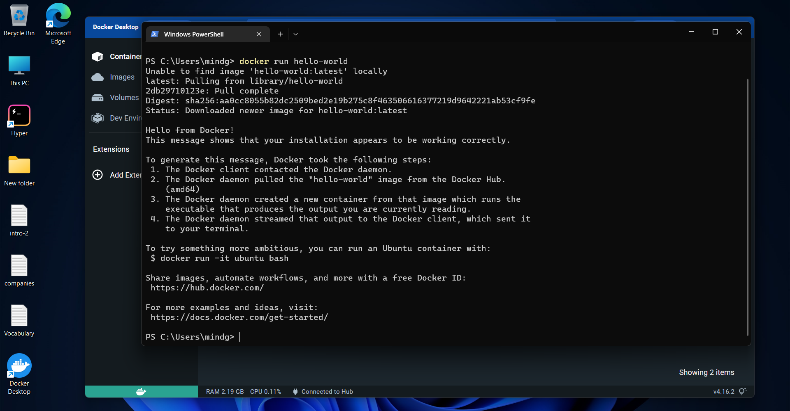
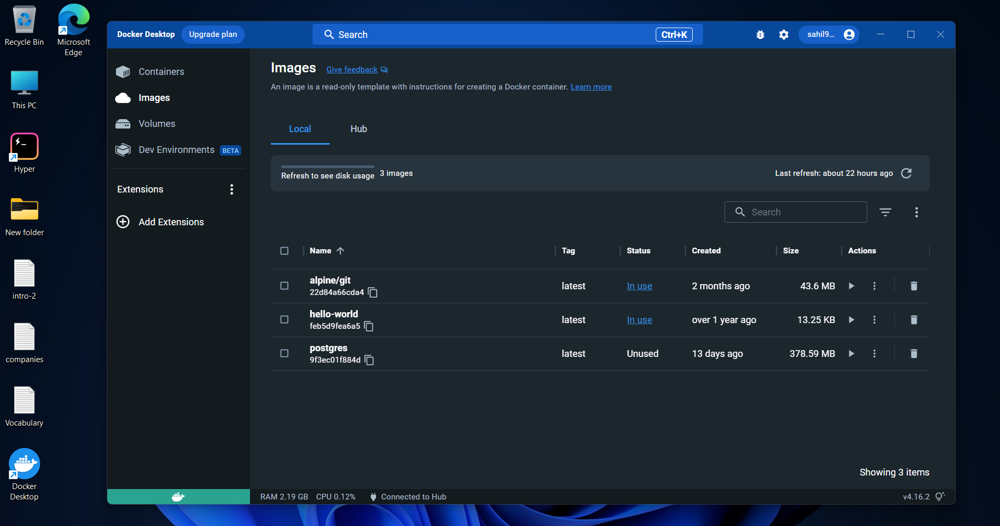
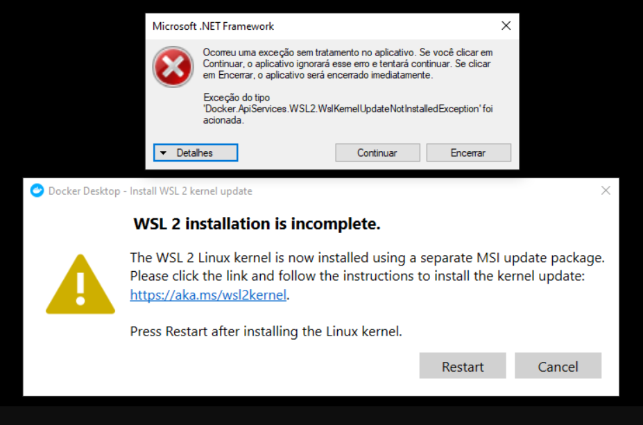

# Install on window
* Download the Docker Desktop for Windows installer from the official website: https://www.docker.com/products/docker-desktop.
* Double-click on the installer file to start the installation process.

* Follow the prompts to complete the installation. This process may take a few minutes.

* Once the installation is complete, open the Docker Desktop application from the Start menu.
* After the application starts, it will automatically download and install the necessary components. This process may take a few minutes.
* Once the installation is complete, you should see a message indicating that Docker is running.

* To test your installation, open the Command Prompt or PowerShell and run the command "docker run hello-world". This command will download and run a test image, which should display a message indicating that Docker is working correctly.


<br>

<!-- Images -->

<br>

### Docker Desktop installation on my windows 11 system 


<br>


<!-- Blockquote -->
> Please also note that you will need to have Windows feature update to Windows 11 and Virtualization enabled in your BIOS or UEFI firmware settings.

<br>

# Containerize an application
To containerize an application, you will need to use Docker, a containerization platform. Here is an overview of the steps to containerize an application.
To upload a project to Docker, you will first need to create a Dockerfile, which is a script that contains instructions for building a Docker image. Once the Dockerfile is created, you can use the "docker build" command to build the image. Once the image is built, you can use the "docker push" command to upload it to a remote repository, such as Docker Hub.

Build and push a Docker image using a Dockerfile.

* Create a new directory for your project, and navigate to it in the command line.
* Create a new file called "Dockerfile" in the project directory.
* Add the following lines to the Dockerfile to specify the base image and set up the environment:   


<!-- Code Blocks -->

```python
   FROM ubuntu:18.04

RUN apt-get update && apt-get install -y \
    build-essential \
    python3 \
    python3-pip

COPY . /app

WORKDIR /app

RUN pip3 install -r requirements.txt

CMD ["python3", "main.py"]

```

* Build the image using the following command.

``` javascript
 docker build -t myproject.
```

* Once the image is built, you can push it to Docker Hub by running the following command:

``` python 
docker push myproject
```

<br>

## So, Now I Uploaded My Own Project(Tincare) On Docker Desktop.

<br>
To upload the project "Tincare-1" from the GitHub repository "https://github.com/sahil98547/Tincare-1.git" to a Docker container, you will need to follow these steps:

1. Install Docker on your machine, if you haven't already done so.
2. Clone the Tincare project from GitHub by running the command:

```bash
   git clone https://github.com/sahil98547/Tincare-1.git
```
3. Navigate to the project directory:
```bash
   cd Tincare-1
```

4. Create a new file called "Dockerfile" in the project directory.
5. Add the following lines to the Dockerfile to specify the base image, install dependencies, and copy the application code:

```python
   FROM python:3.8

COPY . /app

WORKDIR /app

RUN pip install --no-cache-dir -r requirements.txt

EXPOSE 8000

CMD ["python", "manage.py", "runserver", "0.0.0.0:8000"]

```

6. Build the image using the following command:

```javascript
   docker build -t tincare .
```

7. Once the image is built, you can run a container from the image using the "docker run" command, which takes the form of "docker run -it -p 8000:8000 tincare":

```Javascript
   docker run -it -p 8000:8000 tincare
```

This command maps the host port 8000 to the container port 8000, and starts the command specified in the CMD instruction of the Dockerfile.

8. To test your deployment, you can open your browser and navigate to "http://localhost:8000", you should see the web application running.
9. To publish the image to Docker Hub, you will first need to create an account on Docker Hub and log in using the command "docker login".
10. Once you are logged in, you can tag the image with your Docker Hub username using the following command:

```javascript
   docker tag tincare [your_username]/tincare
```

11. Finally, you can use the "docker push" command to upload the image to the remote repository. The command takes the form of "docker push [username]/[image_name]:[version]":
```javascript
    docker push [your_username]/tincare
```

>Note: The above steps are a general guide, your project may have different requirements and you may have to adjust the Dockerfile accordingly. Also, make sure that you have the necessary permissions to execute the project.


<br>

## Problems I Faced During This Exercise.
* Docker is not starting at the beginning when i installed in the window.
* It was showing Docker Desktop is Stop.
* Message is pop-up which showing **WSL 2 installation is incomplete**.
<br>



* The reason is the docker on windows relies on WSL which is windows subsystem for linux.
* So, window has to install some additional components for it to work.
* So, Download the linux kernel update package.
* https://wslstorestorage.blob.core.windows.net/wslblob/wsl_update_x64.msi.
* After that the Docker Desktop is running fine.


* The file name for a Dockerfile must be capitalized as "Dockerfile" and not "dockerfile" in order for Docker to recognize it as the file containing the instructions for building the image. If the file name is not capitalized correctly, Docker will not be able to find the file and will display an error.
